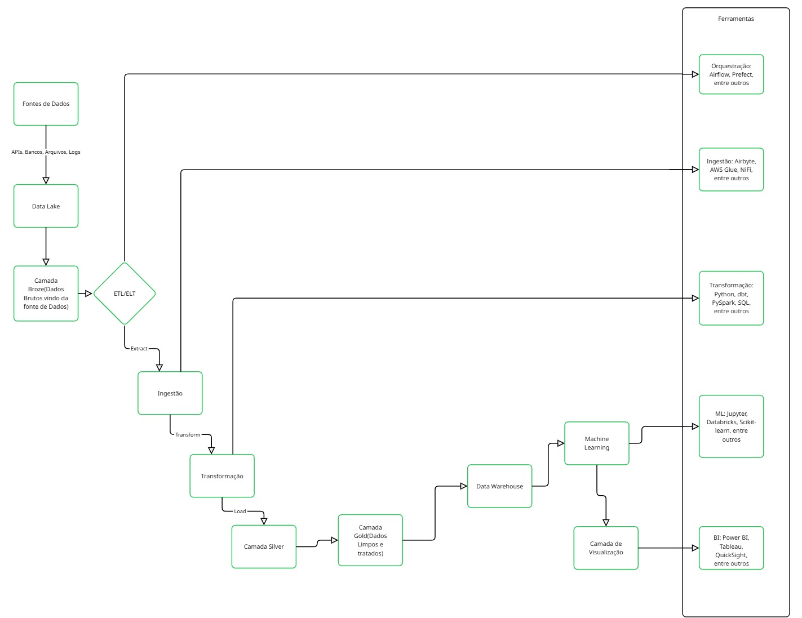
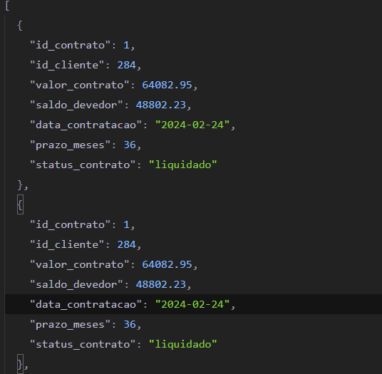

# Desafio 02 de Engenharia de Dados – Risco de Crédito

Este desafio implementa um pipeline completo de engenharia de dados utilizando Python e Pandas, estruturado em camadas de **Data Lake (Bronze, Silver, Gold)**
- fiz uma integração ao **MySQL** e suporte a versionamento histórico (SCD Tipo 2), para testar esse recebimento dos dados via sql

### 1. Ingestão de Dados

- Leitura de arquivos `clientes.csv`, `contratos_credito.json` e `transacoes_financeiras.csv`
- Verificação de integridade:
  - Checagem de chaves primárias
  - Registros órfãos
  - Duplicidade de chaves

### 2. Qualidade e Tratamento

- Validação de:
  - CPFs inválidos
  - Datas inconsistentes
  - Campos nulos
- Normalização de dados:
  - Datas padronizadas
  - Nomes com formatação correta

### 3. Transformação e Modelagem

- Organização em camadas:

  - **Raw**: dados originais
  - **Bronze**: dados crus padronizados
  - **Silver**: dados tratados e integrados
  - **Gold**: tabelas analíticas

- Modelagem:
  - `dim_clientes`
  - `fato_contratos`
  - `fato_transacoes` com agregações mensais e SCD Tipo 2

### 4. Pipeline de Processamento

- Leitura incremental de arquivos (`transacoes_YYYY-MM-DD.csv`)
- Versionamento histórico via SCD Tipo 2 com controle de validade
- Armazenamento na camada Gold

### 5. Disponibilização dos Dados

- Exportação em:
  - CSV 
  - Parquet (otimizado para Big Data)
- Exportação para banco relacional MySQL com SQLAlchemy


### 6. Bônus – Escalabilidade e Automação

- Arquitetura em camadas proposta: 



- Validações automatizadas com função de Data Quality Check
- DAG orquestrável com Apache Airflow para produção

---

## Estrutura de Pastas

```
sql/  ← codigo sql para criação das tabelas
dados/
├── raw/       ← Dados brutos (originais)
│   ├── teste_salvando_dados_bd   ← Fazando teste inserindo os dados vindo do BD
├── bronze/    ← Dados padronizados
├── silver/    ← Dados tratados
├── gold/      ← Dados analíticos (fato e dimensões)
│   ├── dim_clientes.csv
│   ├── fato_contratos.csv
│   ├── fato_transacoes.csv
│   ├── fato_transacoes_historico.csv   ← Historico dos Dados
│   ├── fato_transacoes_historico2.csv  ← Apenas Teste de Historico dos Dados
│   ├── dicionario_fato_transacoes.csv
│   ├── parquet/
│       ├── *.parquet ← Arquivos em parquet
```

---


# Dicionario de Dados

### `dim_clientes`

| Coluna          | Tipo    | Descrição                     |
| --------------- | ------- | ----------------------------- |
| id_cliente      | int64   | Identificador do cliente (PK) |
| nome            | object  | Nome completo do cliente      |
| cpf             | object  | CPF do cliente                |
| data_nascimento | object  | Data de nascimento            |
| renda_mensal    | float64 | Renda mensal declarada        |
| regiao          | object  | Região de origem              |
| data_carga      | object  | Data de ingestão              |

---

### `fato_contratos`

| Coluna           | Tipo    | Descrição                          |
| ---------------- | ------- | ---------------------------------- |
| id_contrato      | int64   | Identificador do contrato (PK)     |
| id_cliente       | int64   | Chave estrangeira para o cliente   |
| valor_contrato   | float64 | Valor total do contrato de crédito |
| saldo_devedor    | float64 | Saldo devedor atual                |
| data_contratacao | object  | Data de contratação                |
| prazo_meses      | int64   | Prazo em meses                     |
| status_contrato  | object  | Status atual do contrato           |
| data_carga       | object  | Data de ingestão                   |

---

### `fato_transacoes`

| Coluna          | Tipo    | Descrição                                      |
| --------------- | ------- | ---------------------------------------------- |
| id_transacao    | int64   | Identificador da transação (PK)                |
| id_cliente      | int64   | Chave estrangeira para o cliente               |
| data_transacao  | object  | Data da transação                              |
| valor_transacao | float64 | Valor financeiro da transação                  |
| tipo_transacao  | object  | Tipo da transação (pagamento, saque, TED, DOC) |

---

# Comentarios de Algumas partes que achei diferente

Na Parte 1 e 2 achei estranho pois não tava retornando dados errados ou faltantes, mas fiz os testes manuais e a logica estava certos pois nos testes manuais gerava os erros, então aparentemente nesta etapa 1 e 2 nenhum dado duplicado por id, ou dados orfãos, ou ausentes conformes os testes abaixos podemos ver que tava funcionando as logicas implementadas:




